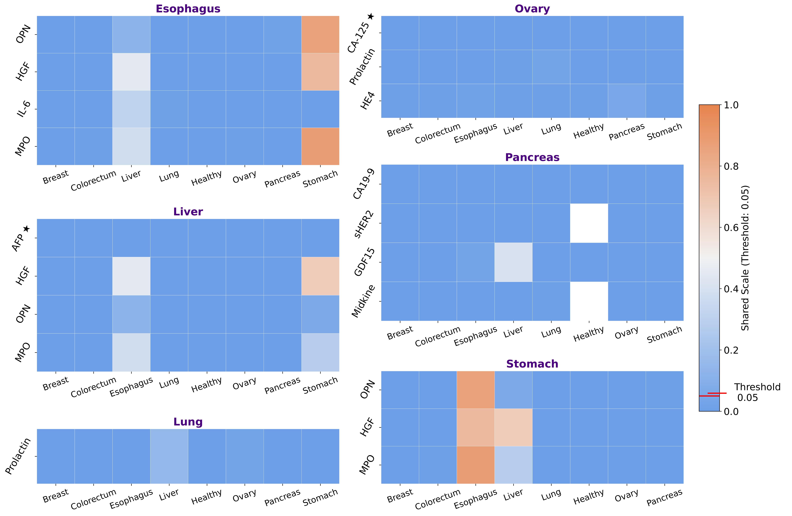

# Cancer Biomarkers from Clinical Data

This project presents a tutorial notebook that guides users through the identification of **cancer biomarkers** from clinical data, using the dataset [data/aar3247_cohen_sm_tables-s1-s11.xlsx](data/aar3247_cohen_sm_tables-s1-s11.xlsx) provided by [Cohen et al. (2018)](https://doi.org/10.1126/science.aar3247). Biomarkers play a critical role in diagnosis, prognosis, and treatment evaluation, and this project provides step-by-step instructions on analyzing clinical datasets to identify them effectively.

The tutorial notebook is suitable for enthusiasts, students, and researchers in the field of bioinformatics and data science who want to explore biomarker discovery in cancer research.

Schema for the entire procedure:

---

## **Tutorial Notebook**

The core of this project is contained in the [Tutorial Notebook](https://github.com/subhajitbn/Cancer-Biomarkers-from-Clinical-Data/blob/main/tutorial.ipynb), which walks users through the complete process of:

- Loading and preprocessing the dataset by Cohen et al. (2018).
- Fitting RandomForest classifiers to identify biomarkers using average MDI scores.
- Performing descriptive statistics-based analysis.
- Visualizing data to identify significant trends.
- Extracting actionable insights from the dataset.

### **Key Topics Covered**
- Data preparation and cleaning.
- Exploratory Data Analysis (EDA) and preliminary feature selection using average MDI scores.
- Statistical modeling for biomarker identification.
- Visualization techniques that illustrate the schema.

🔗 **[Check the notebook directly in nbviewer](https://nbviewer.org/github/subhajitbn/Cancer-Biomarkers-from-Clinical-Data/blob/main/tutorial.ipynb)** and start exploring!
---

## **Installation & Usage**

### Prerequisites
- [Conda](https://www.anaconda.com/docs/getting-started/miniconda/main) with Python 3.12+ installed on your system.
- Required Python packages (see `environment.yml` for details).

### Setup Instructions
1. Clone the repository to your local machine:
   ```bash
   git clone https://github.com/subhajitbn/Cancer-Biomarkers-from-Clinical-Data.git
   cd Cancer-Biomarkers-from-Clinical-Data
   ```
2. Create a conda environment from the `environment.yml` file, and activate it:
   ```bash
   conda env create -f environment.yml
   conda activate cancerbiomarkers
   ```
3. Run the notebook:
   ```bash
   jupyter notebook tutorial.ipynb
   ```
---

## **Overview of the Steps**
As the saying goes, "A picture is worth a thousand words". Here's a visual overview of the major steps in the biomarker discovery pipeline.

### Preliminary Selection of Biomarkers Based on their MDI Scores
---
Note that, we did not make any use of the ascending order of the MDI scores to select the top biomarkers. We employed a cutoff of 0.4 and selected all the biomarkers that passed the cutoff as equally probable.

#### Top Biomarkers based on MDI Scores:

---

### Descriptive Statistics-based Analysis
---
`MDI` scores are not enough to nail down a biomarkers. Sure, these biomarkers are helpful in class label differentiation. But that can happen even if the biomarker level is not particularly pronounced in that cancer type. So, now we look at the `Q2` and `Q3` levels of the selected biomarkers across all the cancer types. If the biomarker level is higher in the cancer type in which it passed the MDI score cutoff, it is more likely to be a biomarker for that cancer type.

The following boxplot clearly shows that in some cancer types, the `Q2` and `Q3` levels a few biomarkers are clear outliers. We do make this more precise in our schema. But the boxplot provides a good overview of the data. For example, `CA-125`, `Prolactin`, and `HE4` have clearly higher levels in `Ovary` compared to other cancer types. Those are the biomarkers that ultimately get selected as the potential biomarkers for ovarian cancer at the end.

#### Boxplot of Biomarker Levels (Q2 and Q3) across the Cancer Types


Also, we do need a biomarker's `Q3` level in it's respective cancer type to be in the top 3. Otherwise we drop that biomarker from further consideration.

#### Q3 Levels of the Biomarkers Ranked in their Respective Cancer Types

---

### Shared Nature of the Biomarkers
---

The Yuen-Welch’s test with 10% trimming was used to compare biomarker levels between a cancer type of interest and other cancer types, accounting for outliers and variability. Biomarkers with p-values > 0.05 in more than two pairwise comparisons were excluded, while those with > 0.05 in one or two comparisons were flagged for further validation as potentially shared.

#### Heatmap for the p-values in Yuen-Welch's Tests

---

### Finally, the Result
---
Considering a small few other things, we end up with the following biomarkers:

#### Venn Diagram of the Selected Biomarkers

---

## **Further Questions**

### Does the Use of MDI Scores Make Sense?
---
Empirically, in this particular dataset, it does. For example, the following graphs show that over a 100 iterations of fitting RandomForest classifiers for `healthy + ovary` samples, the MDI scores converge.

#### Convergence of MDI Scores for Ovary


#### Stability of the Cumulative Mean of the MDI Scores for Ovary

---

### Why not PCA?
---
The following diagram represents the PCA biplot of healthy and pancreatic cancer samples, with top 10 contributing biomarkers in PC1 and PC2 being displayed. The PCA and biplot visualizations are done in `R`. The code is available in the [pca_biplots](pca_biplots) folder. Note that, key biomarkers like `Midkine` and `HGF` are contributing mostly to PC2. And a biomarker that is uniquely elevated in pancreatic cancer, namely `CA19-9`, is absent from the PCA biplot. PCA does not focus on class label distinction specifically. It highlights the variables that contribute to the variance in the data. Hence, often those biomarkers that are elevated in one cancer type, and categorically very low or absent in healthy samples, are not picked up by PCA. This is also the case with Liver. `AFP` is highly elevated in liver cancer, but it is absent in the PCA biplot of liver cancer and healthy samples. 

#### PCA Biplot of Healthy + Pancreas samples

---

### Isn't the procedure computationally intensive?
---
Instead of the more computationally costly procedure of `permutation importance` or `MDA`, we have used `MDI`, which is calculated as an intrinsic part of the tree-building process. Some effort has been made in the paper to justify this choice. This single choice significantly reduces the computational cost for the overall procedure. For the particular dataset by Cohen et al. (2018), this proves to be enough. 

But, for other higher-dimensional serum biomarker datasets with more samples, some further optimizations might be required. We suggested a few ideas in the paper. Some of them are as follows:

1. Instead of an exact computation of the MAD (Median Absolute Deviation) in the statistical filtering stage, we can use an approximate MAD. While an exact MAD computation is costly, oftentimes an approximate MAD can be calculated in a linear time and constant space cost using the procedure given by [Chen et al.(2021)](https://dl.acm.org/doi/10.14778/3476249.3476266).

2. We can use a parallelized implementation of the 100 iterations of RandomForest classifier fitting to speed up the computation of the average MDI scores. A brief overview of the profile of the project shows that the function that handles this is the most time consuming part of the entire procedure. You can visit [this static page](https://subhajitbn.github.io/assets/cancer_biomarkers_from_clinical_data_profile.html) for a detailed outlook. It shows the [SnakeViz](https://github.com/jiffyclub/snakeviz/) visualization of `cProfile`-generated output [program.prof](src/program.prof) for the entire procedure. The self-contained html file `cancer_biomarkers_from_clinical_data_profile.html` is generated using [this script](https://gist.github.com/MSSandroid/6402e2e99e31633386a312b283839e0d).  
---

## **Acknowledgements**
We thank all colleagues and project students of the School of Physical Sciences, Sikkim University, for their support while completing computational work in the numerical lab. 
